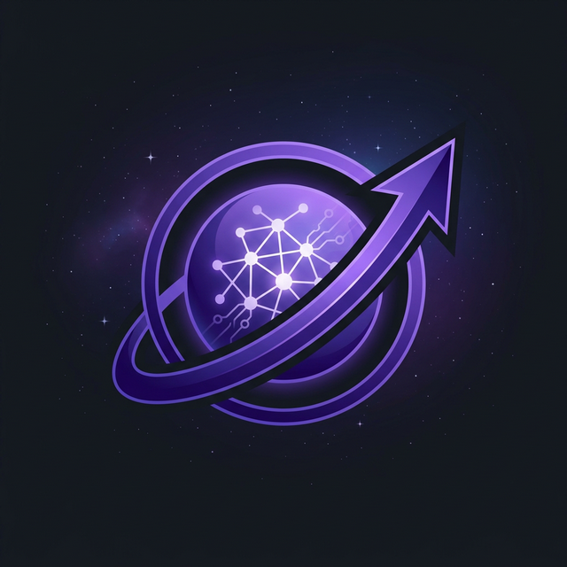

<div align="center">



# Plantilla de Workspace de Antigravity

**Kit inicial de nivel producción para agentes autónomos de IA.**

*Compatible con cualquier IDE de IA · Cualquier CLI · Cualquier LLM*

Idioma: [English](README.md) | [中文](README_CN.md) | **Español**

[](LICENSE)
[](https://ai.google.dev/)
[](https://openai.com/)
[](https://python.org/)

<br/>


</div>

<br/>

> **Clonar → Renombrar → Pedir. Ese es el flujo de trabajo.**
>
> En un mundo lleno de IDEs de IA, quiero que la arquitectura de nivel empresarial sea tan simple como tres comandos. Esta plantilla pre-incrusta una **arquitectura cognitiva** completa—cuando la abres, tu IDE deja de ser un editor y se convierte en un **arquitecto que entiende el negocio**.

---

## 🌍 Compatibilidad Universal

Esta plantilla **no** está atada a ningún IDE específico. Funciona en todas partes:

| Plataforma | Cómo funciona |
|:-----------|:-------------|
| **Google Antigravity** | Lee `.antigravity/rules.md` para conciencia de contexto completa |
| **Cursor** | Lee `.cursorrules` para reglas a nivel de proyecto |
| **Windsurf / VS Code + Copilot** | Usa archivos `.context/` para inyección de conocimiento |
| **Claude Code** | Lee `AGENTS.md` + `CONTEXT.md` para convenciones del proyecto |
| **Gemini CLI** | Lee `AGENTS.md` + `.context/` para inyección de conocimiento |
| **Codex (OpenAI)** | Lee `AGENTS.md` + convenciones de directorio |
| **Cline / Aider** | Aprovecha `CONTEXT.md` + convenciones de directorio |
| **Cualquier agente compatible con OpenAI** | Herramientas auto-descubiertas en `src/tools/`, entrada Python estándar |

El secreto: la arquitectura está codificada en **archivos**, no en plugins específicos del IDE. Cualquier agente que lea archivos del proyecto se beneficia.

---

## ⚡ Inicio Rápido

### Instalación automática (recomendada)

**Linux / macOS:**
```bash
# 1. Clona la plantilla
git clone https://github.com/study8677/antigravity-workspace-template.git mi-proyecto
cd mi-proyecto

# 2. Ejecuta el instalador
chmod +x install.sh
./install.sh

# 3. Configura tus claves de API
nano .env

# 4. Ejecuta el agente
source venv/bin/activate
python src/agent.py
```

**Windows:**
```cmd
# 1. Clona la plantilla
git clone https://github.com/study8677/antigravity-workspace-template.git mi-proyecto
cd mi-proyecto

# 2. Ejecuta el instalador
install.bat

# 3. Configura tus claves de API (notepad .env)

# 4. Ejecuta el agente
python src/agent.py
```

<details>
<summary><b>📋 Instalación manual</b></summary>

```bash
git clone https://github.com/study8677/antigravity-workspace-template.git mi-proyecto
cd mi-proyecto
python3 -m venv venv
source venv/bin/activate  # En Windows: venv\Scripts\activate
pip install -r requirements.txt
cp .env.example .env      # (si existe) o crea .env manualmente
nano .env
python src/agent.py
```
</details>

**Eso es todo.** El IDE carga la configuración automáticamente y estás listo para pedir.

---

## 🎯 ¿Qué es esto?

Esto **no** es otro wrapper de LangChain. Es un workspace mínimo y transparente para construir agentes de IA:

| Característica | Descripción |
|:---------------|:------------|
| 🧠 **Memoria infinita** | Resumización recursiva que comprime contexto automáticamente |
| 🧠 **Pensamiento Real** | Paso de "Deep Think" (Chain-of-Thought) antes de actuar |
| 🎓 **Sistema de Habilidades** | Capacidades modulares en `src/skills/` con carga automática |
| 🛠️ **Herramientas universales** | Funciones Python en `src/tools/` → se descubren solas |
| 📚 **Contexto automático** | Archivos en `.context/` → se inyectan en los prompts |
| 🔌 **Soporte MCP** | Conecta GitHub, bases de datos, sistemas de archivos |
| 🤖 **Agentes Swarm** | Orquestación multiagente con patrón Router-Worker |
| ⚡ **Nativo de Gemini** | Optimizado para Gemini 2.0 Flash |
| 🌐 **Independiente del LLM** | Usa OpenAI, Azure, Ollama o cualquier API compatible |
| 📂 **Artifact-First** | Flujo por convención para planes, logs y evidencia |
| 🔒 **Sandbox** | Ejecución configurable (local / microsandbox) |

---

## 🏗️ Estructura del Proyecto

```
src/
├── agent.py           # Bucle principal del agente
├── memory.py          # Gestor de memoria JSON
├── mcp_client.py      # Integración de MCP
├── swarm.py           # Orquestación multiagente
├── agents/            # Agentes especialistas
├── tools/             # Herramientas personalizadas (auto-descubiertas)
└── skills/            # Habilidades modulares (auto-cargadas)

.context/             # Base de conocimiento (auto-inyectada)
.antigravity/         # Reglas de Antigravity
.cursorrules          # Reglas de Cursor
artifacts/            # Salidas y evidencia
```

---

## 💡 Construye una herramienta en 30 segundos

```python
# src/tools/my_tool.py
def analyze_sentiment(text: str) -> str:
    """Analiza el sentimiento del texto dado."""
    return "positive" if len(text) > 10 else "neutral"
```

**Reinicia el agente.** ¡Listo! La herramienta ya está disponible para cualquier IDE de IA.

---

## 🎓 Inicializa un nuevo repo con Skill

La skill integrada `agent-repo-init` soporta dos modos:
- `quick`: scaffold limpio mínimo
- `full`: scaffold + configuración de runtime por defecto

```bash
python skills/agent-repo-init/scripts/init_project.py \
  --project-name my-new-agent \
  --destination-root /absolute/path/for/new/projects \
  --mode quick
```

<details>
<summary><b>Ejemplo modo full</b></summary>

```bash
python skills/agent-repo-init/scripts/init_project.py \
  --project-name my-new-agent \
  --destination-root /absolute/path/for/new/projects \
  --mode full --llm-provider openai --enable-mcp --disable-swarm \
  --sandbox-runtime microsandbox --init-git
```
</details>

---

## 🔌 Integración de MCP

Conecta herramientas externas:

```json
{
  "servers": [
    {
      "name": "github",
      "transport": "stdio",
      "command": "npx",
      "args": ["-y", "@modelcontextprotocol/server-github"],
      "enabled": true
    }
  ]
}
```

---

## 🤖 Swarm Multiagente

Descompón tareas complejas:

```python
from src.swarm import SwarmOrchestrator

swarm = SwarmOrchestrator()
result = swarm.execute("Construir y revisar una calculadora")
```

El swarm enruta automáticamente a los agentes Coder, Reviewer y Researcher, sintetiza resultados y expone logs.

---

## 🔒 Configuración de Sandbox

| Variable | Default | Opciones |
|:---------|:--------|:---------|
| `SANDBOX_TYPE` | `local` | `local` · `microsandbox` |
| `SANDBOX_TIMEOUT_SEC` | `30` | segundos |
| `SANDBOX_MAX_OUTPUT_KB` | `10` | KB |

<details>
<summary><b>Variables extra de Microsandbox</b></summary>

| Variable | Default |
|:---------|:--------|
| `MSB_SERVER_URL` | `http://127.0.0.1:5555` |
| `MSB_API_KEY` | (opcional) |
| `MSB_IMAGE` | `microsandbox/python` |
| `MSB_CPU_LIMIT` | `1.0` |
| `MSB_MEMORY_MB` | `512` |
</details>

---

## 📚 Documentación

| Idioma | Enlace |
|:-------|:-------|
| 🇬🇧 English | **[`/docs/en/`](docs/en/)** |
| 🇨🇳 中文 | **[`/docs/zh/`](docs/zh/)** |
| 🇪🇸 Español | **[`/docs/es/`](docs/es/)** |

---

## ✅ Progreso

- ✅ Fases 1-7: Foundation, DevOps, Memory, Tools, Swarm, Discovery
- ✅ Fase 8: Integración de MCP (totalmente implementada)
- 🚀 Fase 9: Enterprise Core (en progreso)

Consulta la [Hoja de Ruta](docs/es/ROADMAP.md) para detalles.

---

## 🤝 Contribuyendo

¡Las ideas también cuentan como contribuciones! Abre un [issue](https://github.com/study8677/antigravity-workspace-template/issues) para reportar bugs, sugerir funcionalidades o proponer arquitectura.

## 👥 Contribuidores

- [@devalexanderdaza](https://github.com/devalexanderdaza) — Primer contribuidor. Implementó herramientas de demo, mejoró la funcionalidad del agente, propuso la hoja de ruta "Agent OS" y completó la integración MCP.
- [@Subham-KRLX](https://github.com/Subham-KRLX) — Añadió carga dinámica de herramientas y contexto (Fixes #4) y el protocolo de clúster multiagente (Fixes #6).

## ⭐ Star History

[](https://star-history.com/#study8677/antigravity-workspace-template&Date)

## 📄 Licencia

Licencia MIT. Ver [LICENSE](LICENSE) para detalles.

---

<div align="center">

**[📚 Explorar documentación completa →](docs/es/)**

*Construido con ❤️ para la era del desarrollo AI-nativo*

</div>
